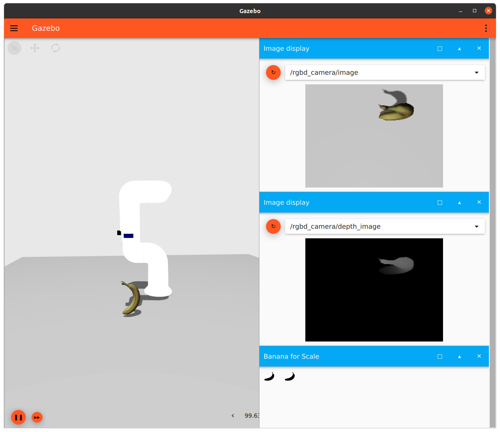
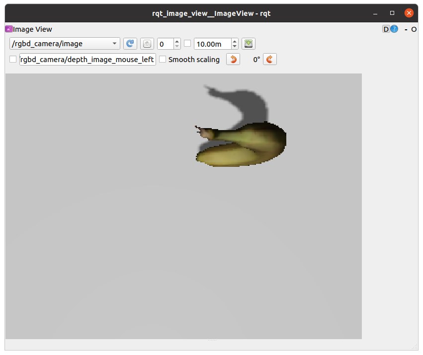

# README

# indy7_ign_moveit

make vision environment

## add rgab_camera

### modify /indy7_ign_moveit2/worlds/indy7_follow.sdf

add sensor plugin in 

```html
<!-- sensor -->
<plugin
    filename="ignition-gazebo-sensors-system"
    name="ignition::gazebo::systems::Sensors">
    <render_engine>ogre2</render_engine>
</plugin>
```

make model named "Indy7" & append joint & make rgbd camera link

```xml
<!-- Indy7 -->
<model name="Indy7">
<pose>0 0 0 0 0 0</pose>
<!-- line 178~256 -->
<inculde>
		...
</include>
<joint name="rgbd_joint" type="fixed">
    <parent>indy7::ind7_link7</parent>
    <child>link</child>
    <axis>
        <xyz>0 0 1</xyz>
    </axis>
</joint>
<!-- line 266-310 -->
<!-- RGBD camera -->
<link name="link">
    <pose relative_to="indy7::indy7_link7">0 0.05 0 0 -1.57 0</pose>
    <visual name="visual">
    <geometry>
        <box>
        <size>0.02 0.02 0.05</size>
        </box>
    </geometry>
    </visual>
    <sensor name="rgbd_camera" type="rgbd_camera">
<!-- camera parameter -->
    <camera>
        <horizontal_fov>1.047</horizontal_fov>
        <image>
        <width>320</width>
        <height>240</height>
        </image>
        <clip>
        <near>0.1</near>
        <far>100</far>
        </clip>
    </camera>
    <always_on>1</always_on>
    <update_rate>30</update_rate>
    <visualize>true</visualize>
    <topic>rgbd_camera</topic>
    <enable_metrics>true</enable_metrics>
    </sensor>
</link>
</model>
```

## add ros_ign_bridge

### modify /indy7_ign_moveit2_main/launch/ign_moveit2.launch.py

- add RGDB Image bridge

```python
# RGDB Image bridge (IGN -> ROS2) : 7
  Node(package='ros_ign_bridge',
       executable='parameter_bridge',
       name='parameter_bridge_rgbd_image',
       output='screen',
       arguments=['/rgbd_camera/image@sensor_msgs/msg/Image@ignition.msgs.Image',
                  '--ros-args', '--log-level', log_level],
       parameters=[{'use_sim_time': use_sim_time}]),
```

- add RGDB Depth Image bridge

```python
# RGDB Depth bridge (IGN -> ROS2) : 8
Node(package='ros_ign_bridge',
     executable='parameter_bridge',
     name='parameter_bridge_rgbd_depth',
     output='screen',
     arguments=['/rgbd_camera/depth_image@sensor_msgs/msg/Image@ignition.msgs.Image',
                '--ros-args', '--log-level', log_level],
     parameters=[{'use_sim_time': use_sim_time}]),
```

- add RGDB camera info bridge

```python
# RGDB camera info bridge (IGN -> ROS2) : 9
Node(package='ros_ign_bridge',
     executable='parameter_bridge',
     name='parameter_bridge_rgbd_camera_info',
     output='screen',
     arguments=['/rgbd_camera/camera_info@sensor_msgs/msg/CameraInfo@ignition.msgs.CameraInfo',
                '--ros-args', '--log-level', log_level],
     parameters=[{'use_sim_time': use_sim_time}])
```

## RUN

```xml
ros2 launch indy7_ign_moveit2 example_follow_object.launch.py
```

Clink  ⋮ button & add Image display & add Banana for Scale


```html
ros2 run rqt_image_view rqt_image_view /rgbd_camera/image
```


```xml
ros2 topic echo /rgdb_camera/camera_info
```

```bash
---
header:-
  stamp:
    sec: 1
    nanosec: 260000000
  frame_id: Indy7/link/rgbd_camera
height: 240
width: 320
distortion_model: plumb_bob
d:
- 0.0
- 0.0
- 0.0
- 0.0
- 0.0
k:
- 277.0
- 0.0
- 160.0
- 0.0
- 277.0
- 120.0
- 0.0
- 0.0
- 1.0
r:
- 1.0
- 0.0
- 0.0
- 0.0
- 1.0
- 0.0
- 0.0
- 0.0
- 1.0
p:
- 277.0
- 0.0
- 160.0
- -0.0
- 0.0
- 277.0
- 120.0
- 0.0
- 0.0
- 0.0
- 1.0
- 0.0
binning_x: 0
binning_y: 0
roi:
  x_offset: 0
  y_offset: 0
  height: 0
  width: 0
  do_rectify: false
---
```
