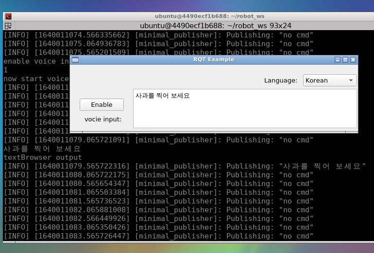

# indy_vision_task_sim

This package provides a simulation work as a team project of PBL-based Robot Control(FIR) lecture by [Professor Youngjin Choi](http://biorobotics.hanyang.ac.kr/doku.php?id=faculty).

This work is currently implemented by three work lines: ros1 gazebo([ghpark branch](https://github.com/zhaoruinan/indy_vision_task_sim/tree/ghpark)), ros2 pybullet(main branch), ros2 Ignition Gazebo([dwlee branch](https://github.com/zhaoruinan/indy_vision_task_sim/tree/dwlee)).

Indy 시뮬레이터에 음성+비전 인식 기반 작업 Plug-in: eg. "사과 집어 하면 사과 인식해서 집는 것"

Here is an introduction for the simulation work by ros2 and pybullet.
At frist, a docker build file is used to prepare our development  environment.

This Dockerfile is based on [tiryoh/ros2-desktop-vnc:foxy](https://github.com/Tiryoh/docker-ros2-desktop-vnc).
## Build a docker img of ros2 foxy and vnc and run it in a docker container :
```
git clone https://github.com/zhaoruinan/indy_vision_task_sim.git
cd indy_vision_task_sim/docker_ros2_foxy_vnc
docker build -t zrn/ros2-vnc-terminator .
#docker run -p 6080:80 --rm  zrn/ros2-vnc-terminator
```
### Run docker container with source code directory(which will used by ros2 work directory):
```
cd ..
cp -r ./src_ros2 Your_Directory_of_robot_ws/src
docker run -p 6080:80  --rm -v Your_Directory_of_robot_ws:/home/ubuntu/robot_ws zrn/ros2-vnc-terminator
```
Because of VNC, a cross-platform screen sharing system, we can access docker container by as simple as a web browser.
### Browse http://127.0.0.1:6080/.


### Open terminator


In docker container's vnc terminator:
```
cd ~/robot_ws
colcon build
source install/setup.bash
```
### Start simulation :
```
ros2 run ros2_sim_indy_pybullet ros2_sim_indy_pybullet
```


### Try Yolo_v4
We take use of [yolo_v4](https://arxiv.org/abs/2004.10934) for the object detecton method in our work.
```
cd ~/robot_ws/src/ros2_yolo/ros2_yolo
git clone https://github.com/AlexeyAB/darknet
cd darknet
mkdir build_release
cd build_release
wget https://github.com/Kitware/CMake/releases/download/v3.20.2/cmake-3.20.2.tar.gz
tar -zxvf cmake-3.20.2.tar.gz
cd cmake-3.20.2
./bootstrap
make 
sudo make install 
cd ..
sudo rm -r *
```
Close the terminator and open it again:
```
cd ~/robot_ws/src/ros2_yolo/ros2_yolo/darknet/build_release
cmake .. -DENABLE_CUDA=OFF
make
cp libdarknet.so ../
cp darknet.so ../
cd ..
```

After doing these changes,just exeute the following command.
```
wget --no-check-certificate 'https://docs.google.com/uc?export=download&id=1cewMfusmPjYWbrnuJRuKhPMwRe_b9PaT' -O yolov4.weights -r -A 'uc*' -e robots=off -nd
```
Now try Yolo_v4 by the following command.
```
./darknet detect cfg/yolov4.cfg yolov4.weights data/person.jpg
```

This work is base on a work of https://robocademy.com/2020/05/01/a-gentle-introduction-to-yolo-v4-for-object-detection-in-ubuntu-20-04/.

After building darknet lib, because the cmake version which ros2 depends is different from darknet, the docker container should be rebooted. In the rebooted docker container's terminator:
```
cd ~/robot_ws
source install/setup.bash
```
### Try camera in pybullet simulation env
```
ros2 run ros2_sim_indy_pybullet ros2_sim_indy_pybullet
rqt
```

The 3D models is base on a work of https://github.com/reail-iitd/COL864-Task-Planning.
### Try Yolo_V4 with a camera by ROS2 in pybullet simulation env 

```
ros2 run ros2_yolo service
ros2 run ros2_yolo client /bullet_camera/rgbimg/rgbimg_raw
```

### Try grasping in pybullet simulation env

```
cd robot_ws/src/python_code/
git clone https://github.com/caelan/motion-planners.git
git clone https://github.com/caelan/pybullet-planning.git
cd pybullet-planning
cp ../indy7_pybullet/indy_primitives.py pybullet_tools/
cp ../indy7_pybullet/test_indy_pick.py examples/
cp -r ../motion-planners/motion_planners ./
python -m examples.test_indy_pick
```
[](https://www.youtube.com/watch?v=GvZ9Z4I_hWY "Everything Is AWESOME")

This part is based on [caelan/pybullet-planning](https://github.com/caelan/pybullet-planning).

### Try GUI with voice recognition
Add micphone device access to docker(This is only for ubuntu) by "--device /dev/snd:/dev/snd ".
```
docker run -p 6080:80 --device /dev/snd:/dev/snd  --rm -v Your_Directory_of_robot_ws:/home/ubuntu/robot_ws zrn/ros2-vnc-terminator
```
In docker vnc terminator:
```
ros2 run ros2_voice_recognition ros2_voice_recognition
```

This part is based on [speech_recognition](https://github.com/Uberi/speech_recognition).
### Try to take all parts into one simple demo

## Task list:
- [x] Choose platform for simulation: pybullet
- [x] Add simulation development envirment to docker file.
- [x] Choose voice recognition solution
- [ ] Simple demo of all work

## License
## Acknowledgements
licensed under the Apache License 2.0.
