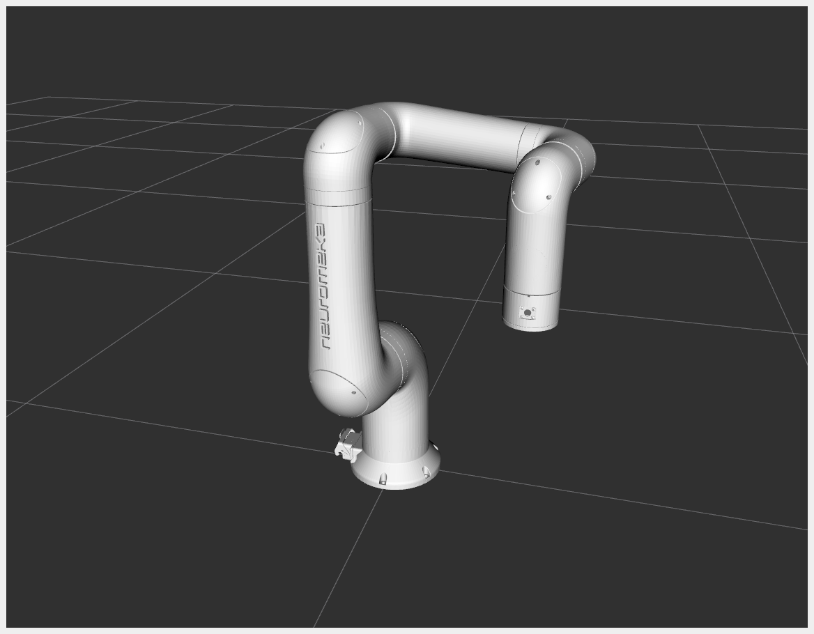

# indy7_ign
ROS2 및 Ignition Gazebo 환경에서 indy7을 불러들이기 위한 model 파일(urdf, sdf)을 포함하고 있습니다.



# 설치 및 확인
다음의 명령어를 통해 원격 저장소로부터 package를 내려받아 자신의 colcon workspace에 설치합니다.

```bash
mkdir -p ~/robot_ws/src # colcon workspace가 없을 경우만 수행합니다.
cd ~/robot_ws/src
git clone https://github.com/HYU-PBLRC-PB1/indy7_ign.git # 원격 저장소로부터 package를 다운로드합니다.
cd ~/robot_ws && colcon build --symlink-install # colcon workspace에서 빌드를 진행합니다.
```

# 패키지 구조
원격 저장소로부터 내려받은 패키지의 파일 구조를 확인하기 위해 다음의 명령어를 수행합니다.
```bash
cd ~/robot_ws/src/indy7_ign
tree
```

```bash
indy7_ign
├── CMakeLists.txt
├── indy7
│   ├── meshes # urdf 및 sdf에서 참조하는 mesh 파일
│   │   ├── collision
│   │   │   ├── link0.stl
│   │   │   ├── link1.stl
│   │   │   ├── link2.stl
│   │   │   ├── link3.stl
│   │   │   ├── link4.stl
│   │   │   ├── link5.stl
│   │   │   └── link6.stl
│   │   └── visual
│   │       ├── link0.stl
│   │       ├── link1.stl
│   │       ├── link2.stl
│   │       ├── link3.stl
│   │       ├── link4.stl
│   │       ├── link5.stl
│   │       └── link6.stl
│   ├── model.config # Ignition model meta file
│   ├── model.sdf # SDF description of the indy7
│   └── thumbnails
│       └── 1.png
├── LICENSE
├── package.xml
├── README.md
├── scripts
│   ├── estimate_inertial_properties.py
│   └── indy7_inertial_out.sdf
└── urdf
    └── indy7.urdf
```